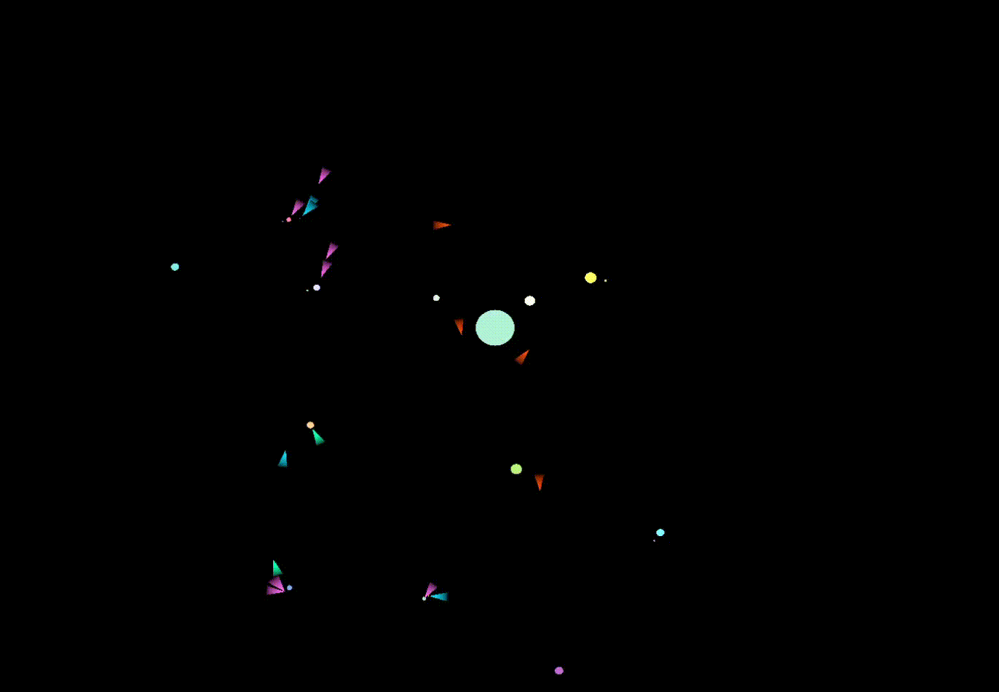

ifdef::backend-html5[]
:full-width: role=full-width
:half-width: role=half-width
endif::[]

ifdef::backend-pdf[]
:full-width: pdfwidth=100%
:half-width: pdfwidth=50%
endif::[]

ifdef::backend-docbook5[]
:full-width: scaledwidth=100%
:half-width: scaledwidth=50%
endif::[]

= Solisora

A solar system simulation in which different types of ships interact. The project's name is a portmanteau of two latin words: _ora_, "edge" and _solis_ "of the sun." I envisioned this project as a sort of screen-saver, with the goal of familiarizing myself with WGPU at a very basic level. Thanks to Benjamin Hansen for this amazing WGPU tutorial: https://sotrh.github.io/learn-wgpu/[].

== Planets & Moons

Planetary systems—planets and the moons that orbit them—are built independently before being added to the sun's orbit. 
All non-solar bodies can be home to a number of planetary features.

== Ship Behavior

[horizontal]
Mining :: Lands on resource-rich planets to mine ore. 
When its cargo hold is full, it detaches and seeks out the closest station to deposit. 
The process then repeats with the mining ship returning to the ore planet.
Trader :: These ships randomly choose a station to be their destination. 
If the station they last visited has more resources than their target, they fill their cargo hold, bringing valuable ore to the undersupplied destination.
Pirate :: Each pirate ship patrols its own territory, seeking out traders with cargo. 
Unlike the other two ship types, pirates can't accelerate, and must rely on a jamming weapon that momentarily kills their prey's engines.
This allows them to close the gap and steal their cargo using short range tractor beams.
Traders are usually free to go after having their cargo seized, but raids can also be fatal.